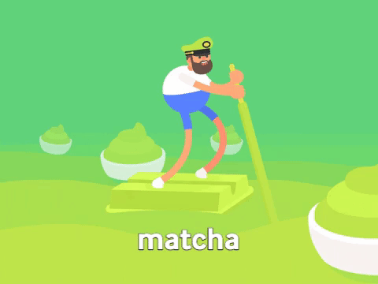
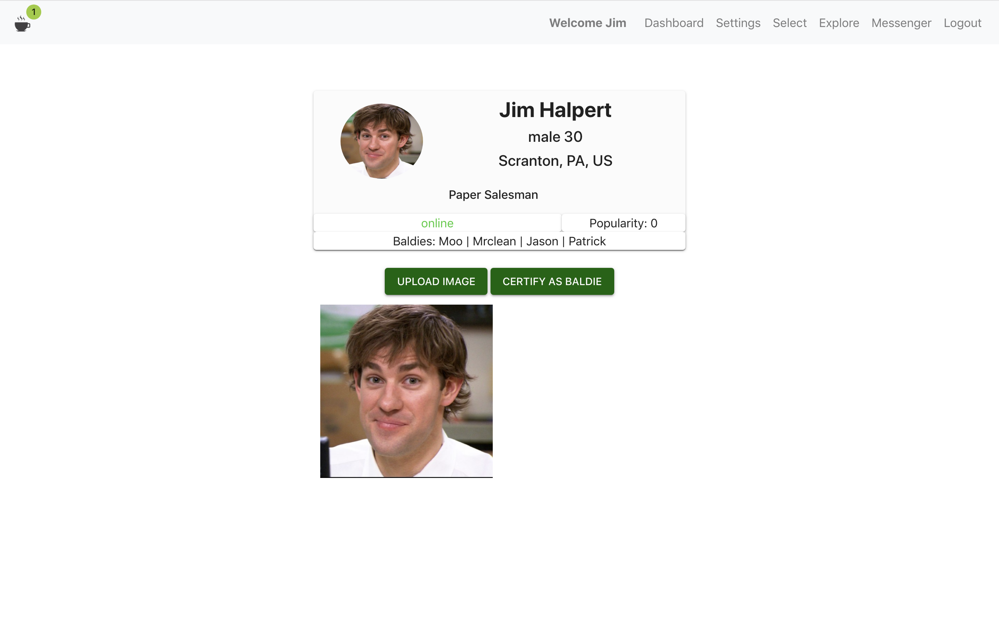
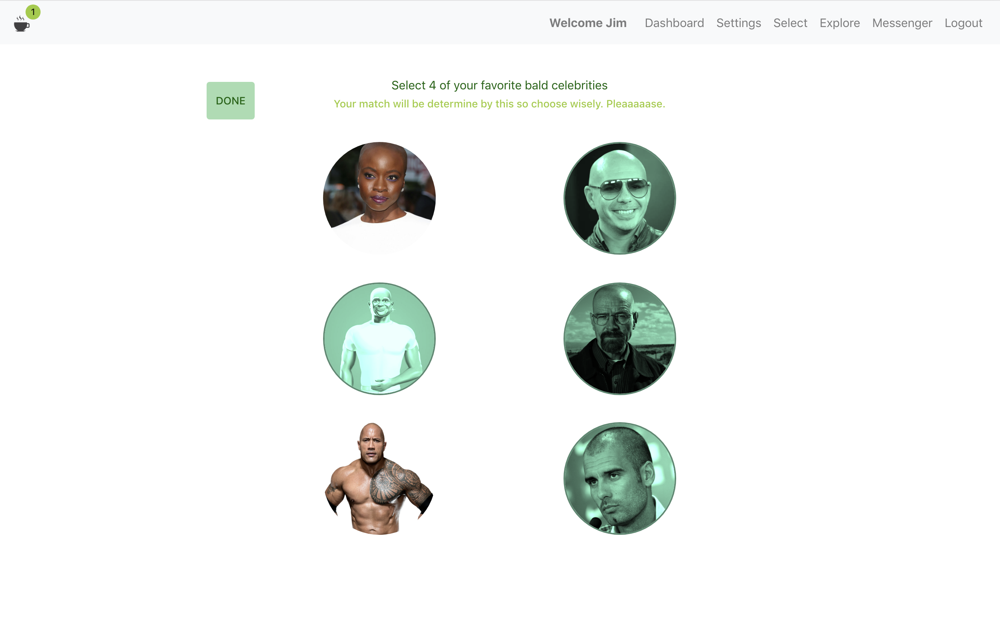
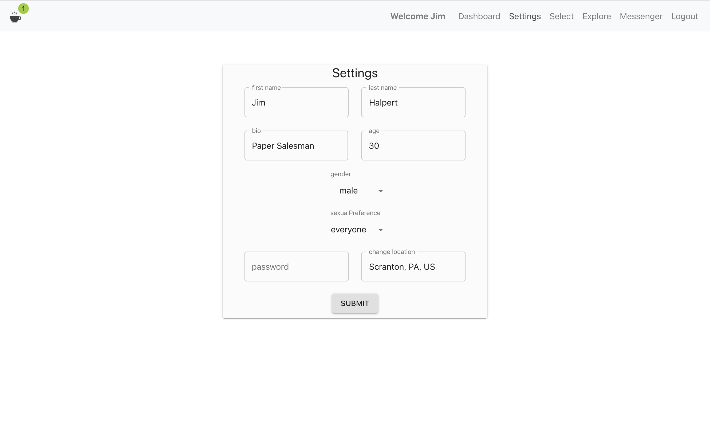
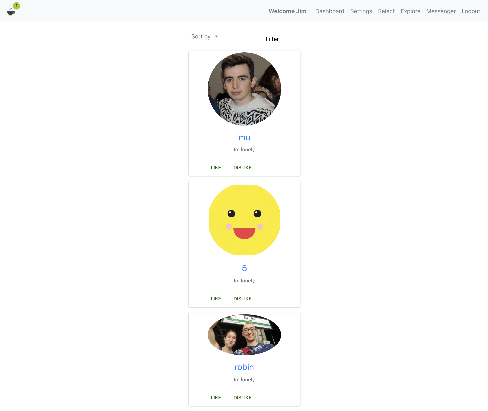

[![LinkedIn][linkedin-shield]][linkedin-url]


<!-- PROJECT LOGO -->
<br />
<p align="center">
  
  <h3 align="center">Matcha</h3>
  
  <p align="center">
    A progressive web app designed to match people based on their favorite bald celebrities
    <br />
    <a href="https://github.com/CptBang/matcha"><strong>Explore the code</strong></a>
    <br />
  </p>
</p>


<!-- TABLE OF CONTENTS -->
## Table of Contents

* [About the Project](#about-the-project)
  * [Built With](#built-with)
* [Getting Started](#getting-started)
  * [Prerequisites](#prerequisites)
  * [Installation](#installation)
* [Screenshots](#screenshots)
* [Contact](#contact)
* [Article](#articles)


<!-- ABOUT THE PROJECT -->
## About The Project
<p align="center">
  
</p>
Matcha is the first project of the web branch in 42 Silicon Valley. As such, the purpose of it is to develop and understand functionalities such as: 

* User sign up / login
* Email sending / link validation
* User matching
* Handle user location
* Liking / disliking
* Upload pictures
* Chat with matches
* Filter and sort potential matches


### Built With

* React
* MongoDB
* Node.js
* Express.js
* create-react-app


<!-- GETTING STARTED -->
## Screenshots

<p align="center">
   |
   |
  
</p>

### Prerequisites

This is an example of how to list things you need to use the software and how to install them.
* npm
```sh
npm install npm@latest -g
```

### Installation
 
1. Clone the repo
```sh
git clone https://github.com/CptBang/matcha
```
2. Install NPM packages
```sh
npm install
```

<!-- CONTACT -->
## Contact

Kev Lozano - [@kevlozano](https://twitter.com/kevlozano)

Project Link: [https://github.com/CptBang/matcha](https://github.com/CptBang/matcha)


<!-- ACKNOWLEDGEMENTS -->
## Articles

* [Four tips for building your first Fullstack app](https://dev.to/kevlozano/four-tips-for-building-your-first-fullstack-app-from-a-beginner-s-perspective-53e7)


<!-- MARKDOWN LINKS & IMAGES -->
<!-- https://www.markdownguide.org/basic-syntax/#reference-style-links -->
[linkedin-shield]: https://img.shields.io/badge/-LinkedIn-black.svg?style=flat-square&logo=linkedin&colorB=555
[linkedin-url]: https://linkedin.com/in/kevinlozanolopez
[product-screenshot]: images/screenshot.png